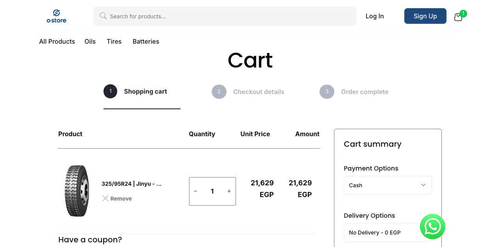
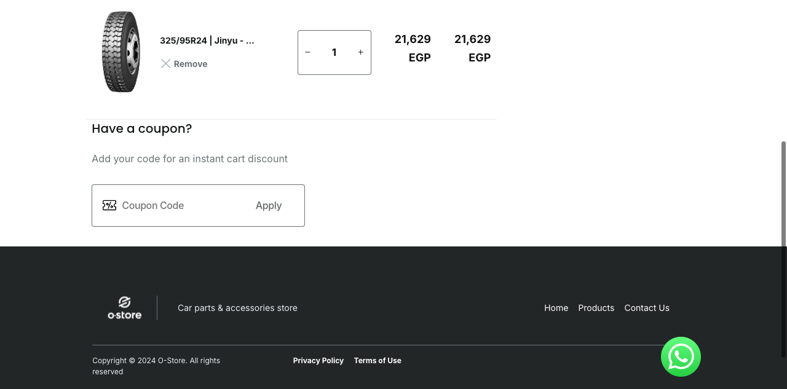
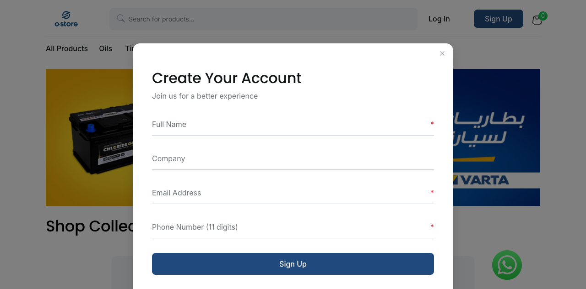

# Critical Issues Report — OStore UAT

**Platform:** https://uat-ostore.vercel.app
**Tested By:** Ahmad Yehia
**Date:** 2026-03-07
**Environment:** Chrome 145 (headless) / Electron / Mobile (375×812)

---

## Summary Table

| Issue # | Title | Severity | Affected Area |
|---------|-------|----------|---------------|
| 1 | Cart Summary Disappears After Cancelling Save Quotation Modal | High | Cart Page |
| 2 | Registration Form Has No Password Field | Critical | Authentication |
| 3 | Order Complete Page (Step 3) Renders Blank | Low | Checkout Flow |

---

## Issue 1: Cart Summary Disappears After Cancelling Save Quotation Modal

**Severity:** High
**Component:** Cart Page — Cart Summary Panel
**Environment:** All browsers

**Steps to Reproduce:**
1. Navigate to `/products` and add any product to the cart
2. Navigate to `/cart`
3. Click the **Save Quotation** button in the cart summary (right panel)
4. When the modal appears, click **Cancel**
5. Scroll down the page

**Expected Result:**
The cart summary panel (right side) remains fully visible and in its correct position after closing the modal. The Save Quotation button, Checkout button, and order total should all be accessible.

**Actual Result:**
After clicking Cancel on the Save Quotation modal, the cart summary panel breaks out of its layout position. On scroll, the panel is pushed above the viewport (observed `top: -146px`) making it completely inaccessible to the user. The cart items remain visible but the user can no longer see their total or proceed to checkout.

**Business Impact:**
- Blocks users from proceeding to checkout after exploring the Save Quotation feature
- Users lose visibility of their order total and payment/delivery options
- Directly interrupts the purchase flow — a high-severity UX and revenue impact
- Automated regression test added to detect this: `quote-request.cy.js` — "Save Quotation Modal Interaction"

**Screenshots:**

*Before — Cart summary visible and in correct position:*

*After — Cart summary displaced off-screen after cancelling modal and scrolling:*

---

## Issue 2: Registration Form Has No Password Field

**Severity:** Critical
**Component:** Authentication — Registration Modal
**Environment:** All browsers

**Steps to Reproduce:**
1. Navigate to `https://uat-ostore.vercel.app/home`
2. Click **Sign Up** button in the navigation bar
3. Observe the registration modal
4. Review all form fields: Full Name, Company, Email Address, Phone Number

**Expected Result:**
Registration form collects credentials including a Password field (with confirmation), or the system sends a password-setup email after registration.

**Actual Result:**
The modal only collects: Full Name, Company, Email Address, Phone Number — **no password field**. The `/sign-in` form requires a password to log in. Users who register via Sign Up modal have no password set, making it impossible to subsequently log in.

**Business Impact:**
- Breaks the core authentication loop: users can register but cannot log in
- May indicate accounts are created without credential setup — a security risk
- Fleet managers cannot access cart, order history, or checkout after registering
- Directly blocks the revenue-generating user journey

**Screenshot:**

*Registration modal — no password field present:*

---

## Issue 3: Order Complete Page (Step 3) Renders Blank

**Severity:** Low
**Component:** Checkout Flow — Order Confirmation Page
**Environment:** All browsers

**Steps to Reproduce:**
1. Add any product to the cart
2. Navigate to `/cart`
3. Observe the 3-step checkout stepper: Shopping cart → Checkout details → Order complete
4. Complete the checkout flow or navigate directly to `/order-confirmation`

**Expected Result:**
After completing an order, the user is directed to an "Order Complete" page (Step 3) showing an order confirmation message, order number, and summary details.

**Actual Result:**
The `/order-confirmation` page renders completely blank. Step 3 "Order complete" exists in the stepper UI but leads to an empty page with no content, no confirmation message, and no order details.

**Business Impact:**
- Users have no confirmation that their order was successfully placed
- No order number or reference is provided after purchase
- Creates uncertainty and distrust in the checkout process
- Users may attempt to re-order thinking the first attempt failed
- Automated regression test added: `checkout/order-flow.cy.js` — "Checkout Stepper Steps"

**Screenshots:**

*Checkout stepper showing Step 3 "Order complete" in the UI:*

*Step 3 — /order-confirmation page renders completely blank:*

---

## Additional Observations (Non-Critical)

| # | Observation | Impact |
|---|-------------|--------|
| A | Cart item count badge does not update dynamically after adding items on same page load | Medium UX |
| B | `/login` URL returns a blank page — auth is at `/sign-in`. External links to `/login` would fail | Low |
| C | No "Maintenance" product category (expected per business domain) | Low |
| D | WhatsApp float button covers content on mobile — no dismiss option | Low UX |
